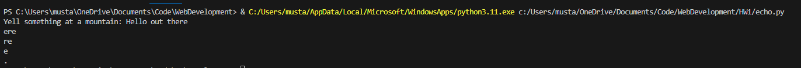
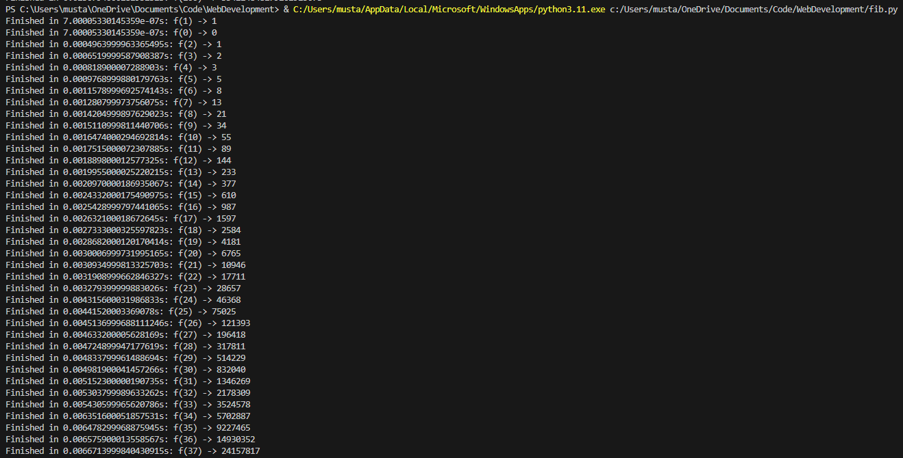
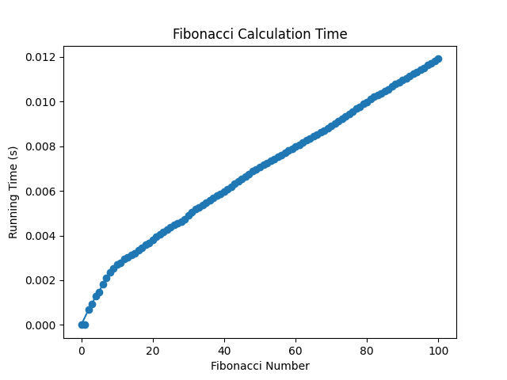
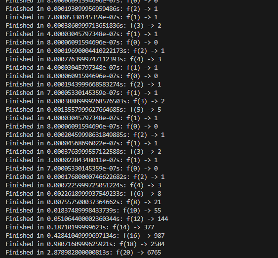
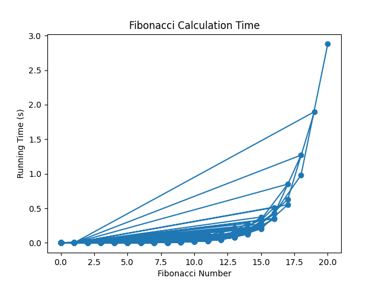

# Echo Simulation

## Overview

This Python function takes a string and and an integer as input and returns an "echo" of the given string, repeating `repetitions` amount of times (default is 3 times)

## Output

# Fibonacci Timer

## Overview

This Python function calculates the fibonnacci sequence with an integer as input, returning the . provides a decorator, `timer`, that can be used to measure the execution time of a function and store the data for Fibonacci series calculations. The timer uses the `timeit` module to ensure accurate timing.

## Output
The output and plot below show that the time it takes to run the fibonnacci function on an input of 100 increases at a near linear rate. This happens due to the `lru_cache` decorator, which drastically reduces the run time of the function. 

Below is an example of the output after runnning without `lru_cache` on an input of 20, you can see how without it the function takes substantially longer to run due to repeating recurring calculations, and increases at an exponential rate.

